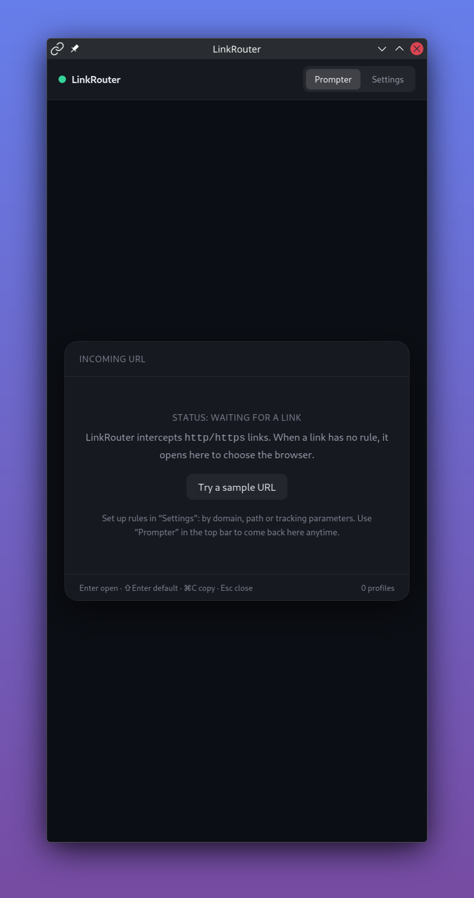
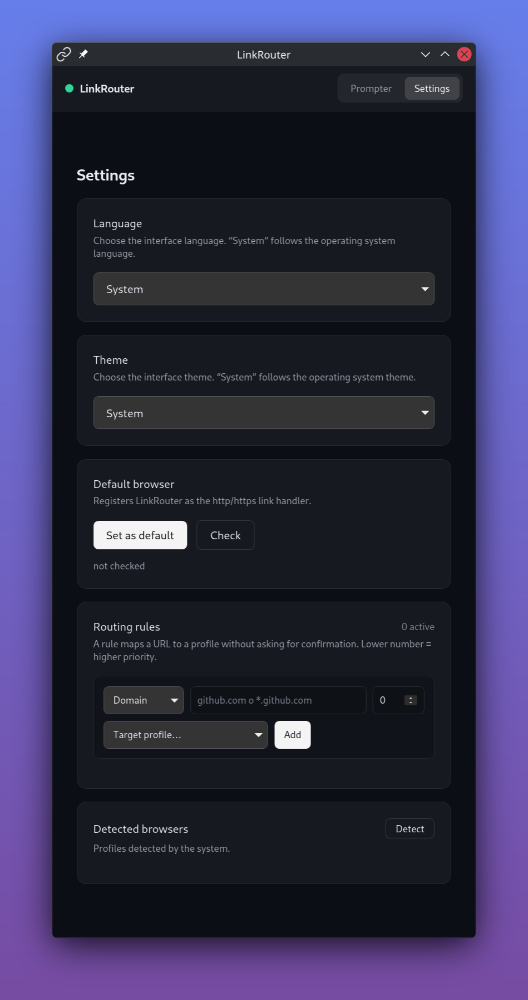

# LinkRouter

Smart deep-link router & browser-selector prompter. A fast, lightweight, cross-platform (Linux, macOS, Windows) desktop app built with **Tauri 2** + **Svelte 5** (SvelteKit) + **Rust**.

When you click a link in any non-browser app (Slack, Discord, Teams, mail client…), LinkRouter intercepts it and either:

- opens it automatically in the right **browser and profile** based on your rules (URL patterns, source app, final destination after unshortening, cleaned of `utm_*` tracking params), or
- shows a fast keyboard-driven **prompter** (on-top, focused) to pick a browser/profile on the fly.

It stays in the **system tray**, hides on close, and relocates links with zero clicks when a rule matches.

## Screenshots
<table>
  <tr>
    <td align="center">
      
      <br/><em>Prompter: pick a browser &amp; profile</em>
    </td>
    <td align="center">
      
      <br/><em>Settings: rules, browsers &amp; defaults</em>
    </td>
  </tr>
</table>

## Tech Stack & Dependencies

- **GUI:** Tauri v2 (Rust, `tray-icon` feature) + [Tauri Plugins](https://github.com/tauri-apps/plugins-workspace): `deep-link`, `single-instance`, `clipboard-manager`
- **Frontend:** Svelte 5 / SvelteKit (TypeScript, Tailwind CSS)
- **Backend:** Rust 1.77+ (edition 2021) — `winreg` on Windows, `env_logger`/`log` for diagnostics, `url`/`regex`/`thiserror`/`serde`
- **Runtimes:** Node.js 20+ and npm (or pnpm) for the frontend toolchain

## Requirements

- [Rust](https://rustup.rs) toolchain >= 1.77 (stable)
- [Node.js](https://nodejs.org) >= 20 + npm
- Linux: GTK3, WebKit2GTK-4.1, libappindicator3 (tray), librsvg — install via your distro (`apt install libwebkit2gtk-4.1-dev build-essential curl wget file libxdo-dev libssl-dev libayatana-appindicator3-dev librsvg2-dev`)
- macOS: no extra deps; Windows: no extra deps

## Build & Run

```bash
git clone <repo-url>
cd link-router
npm install

# Dev (hot-reload + debug console)
npm run tauri dev

# Type-check the frontend
npm run check        # svelte-check + tsc

# Lint the Rust code
(cd src-tauri && cargo check && cargo clippy --all-targets -- -D warnings)

# Production bundle (Linux .deb/.rpm/.AppImage, macOS .dmg/.app, Windows .msi/.exe)
npm run tauri build
```

## Installing unsigned builds

Releases are **not signed or notarized** yet, so macOS Gatekeeper / Windows
SmartScreen will warn. Bypass it once after install (the app is then good):

### macOS

The `.dmg` is not notarized, so double-clicking shows *“Apple could not
verify LinkRouter.app is free of malware”*. Any of these works:

```bash
# Mount the .dmg and drag LinkRouter.app to /Applications, then clear the
# quarantine flag (one-liner, no gatekeeper disabled):
xattr -dr com.apple.quarantine "/Applications/LinkRouter.app"
open "/Applications/LinkRouter.app"
```

### Windows

The MSI/EXE is not code-signed, so you get the *“Windows protected your PC”*
SmartScreen block. Click **More info → Run anyway** (once per install). For
silent installs:

```powershell
# Normalize the SmartScreen marking for this file
Unblock-File .\LinkRouter_0.2.1_x64_en-US.msi
```

### Linux

`.deb`/`.rpm` install fine; just run the AppImage after granting execute
permission:

```bash
chmod +x LinkRouter_*.AppImage
./LinkRouter_*.AppImage
```

> Signing/notarization is planned for a later release (secrets
> `TAURI_SIGNING_PRIVATE_KEY` / `TAURI_SIGNING_PRIVATE_KEY_PASSWORD` on the
> CI and an Apple Developer ID / Windows code-signing cert).

## Configuration file

All rules and settings live in a plain, editable file:

```
~/.config/link-router/config.json      # $XDG_CONFIG_HOME/link-router/config.json
```

```jsonc
{
  "version": 1,
  "settings": {
    "locale": "system",     // "system" | "es" | "en"
    "theme": "system"       // "system" | "light" | "dark"
  },
  "rules": [
    { "id": "r1", "pattern": { "type": "domain", "pattern": "*.company.com" }, "targetProfileId": "work", "priority": 0, "enabled": true }
  ]
}
```

Notes:

- **Missing file** → app runs with built-in defaults (empty rules, `locale: system`, `theme: system`) and creates the file on the first settings/rules save.
- **Invalid JSON / wrong schema** → logs a warning and falls back to defaults; it never crashes.
- **Writes are atomic** (temp file + rename), so a crash never leaves a partial file.
- **Edit it by hand or with dotfiles sync** → the next launch picks up the change automatically.
- Legacy config in `~/.config/linkrouter/config.json` (old rule-array format) is migrated automatically on first run.
- Language (`es`/`en`) and theme (`light`/`dark`/`system`) can also be changed from **Settings**.

## IPC Map (Rust ⇄ UI)

| Event/Command | Direction | Payload |
|---|---|---|
| `dispatch://incoming-url` | Tauri → UI | `{ url, sourceApp }` |
| `open_in_browser` | UI → Tauri | `{ url, browserId, profileId? }` |
| `get_rules` / `create_rule` / `update_rule` / `delete_rule` | UI → Tauri | Rule CRUD |
| `list_browsers` | UI → Tauri | Detected browsers + profiles |
| `get_config` / `save_config` | UI → Tauri | Full `AppConfig { settings, rules }` (atomic) |
| `get_settings` / `save_settings` | UI → Tauri | Partial settings sync (locale, theme) |
| `system_locale` | UI → Tauri | OS locale tag (e.g. `es-AR`, `en-US`) |

## Specs
See [`/spec`](./.spec/): Product Vision, Architecture & IPC, Functional Spec, Implementation Roadmap.
